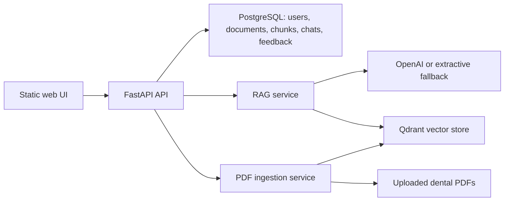

# Dental AI Chatbot

Professional MVP for a Dental AI Retrieval-Augmented Generation chatbot. The app uses FastAPI, PostgreSQL, Qdrant, PDF ingestion, JWT authentication, role-based admin tools, chat history, source citations, and a static frontend.

Dental AI is educational clinical decision support. It does not replace diagnosis, treatment planning, emergency care, or judgment from a licensed dentist.

## Features

- Register and login with JWT authentication.
- Roles: `admin`, `dentist`, `student`, and `patient`.
- Admin PDF upload, document list, delete, and re-ingest.
- PDF parsing with page numbers, chunk indexes, document metadata, and Qdrant point IDs.
- Qdrant vector retrieval with configurable top-k.
- RAG answers grounded in retrieved dental context.
- Citations include document name, page number, chunk index, and score.
- Chat sessions, messages, document records, chunks, and feedback persisted in SQL.
- PostgreSQL and Qdrant via Docker Compose.
- Static MVP UI served by FastAPI.
- Pytest coverage for auth, chat history, feedback, admin upload, and ingestion metadata.
- No hard-coded secrets. Use `.env`.

## Architecture



## Quick Start With Docker

1. Copy the environment template.

```bash
cp .env.example .env
```

2. Edit `.env`.

Required for production-like use:

```bash
JWT_SECRET_KEY=replace-with-a-long-random-secret
OPENAI_API_KEY=your-openai-api-key
```

For local demos, the app still runs without `OPENAI_API_KEY`; it returns an extractive answer from the top retrieved chunk.

3. Start the stack.

```bash
docker compose up --build
```

4. Open the app.

```text
http://localhost:8000
```

5. Register the first admin.

`.env.example` sets `ALLOW_ADMIN_REGISTRATION=true` for MVP setup. For production, disable public admin registration after creating an admin account.

## Local Python Setup

```bash
python -m venv .venv
source .venv/bin/activate
pip install -r requirements.txt
cp .env.example .env
uvicorn app.main:app --reload
```

For local non-Docker development, set:

```bash
DATABASE_URL=sqlite:///./dental_ai.db
QDRANT_URL=http://localhost:6333
```

## Offline Ingestion

Place PDFs in `knowledge_base/`, make sure Qdrant is running, then run:

```bash
python ingest.py
```

The script stores document and chunk metadata in SQL and vectors in Qdrant. Each vector payload includes:

- `text`
- `document_id`
- `document_name`
- `source`
- `page_number`
- `chunk_index`

## API Overview

Auth:

- `POST /api/auth/register`
- `POST /api/auth/login`

Chat:

- `POST /api/chat`
- `GET /api/chat/sessions`
- `POST /api/feedback`

Admin:

- `GET /api/admin/documents`
- `POST /api/admin/documents`
- `POST /api/admin/documents/{document_id}/reingest`
- `DELETE /api/admin/documents/{document_id}`

Health:

- `GET /api/health`
- `GET /api/disclaimer`

## Data Model

- `users`: account, password hash, role, active state.
- `documents`: uploaded PDFs and ingestion status.
- `document_chunks`: chunk text, page number, chunk index, Qdrant point ID.
- `chat_sessions`: user-owned conversations.
- `messages`: user and assistant turns, assistant citations as JSON.
- `feedback`: rating and optional comments for assistant messages.

## Tests

```bash
pytest
```

Tests mock external RAG and ingestion calls where needed, so they do not require OpenAI or Qdrant.

## Security Notes

- Never commit `.env`.
- `JWT_SECRET_KEY` must be long and random outside local demos.
- Passwords are stored with bcrypt hashing.
- Admin-only routes enforce role checks.
- Disable `ALLOW_ADMIN_REGISTRATION` after bootstrap.
- This MVP is not HIPAA-ready. Add compliance controls before handling real patient data.

## Project Structure

```text
app/
  core/          configuration, database, security
  routers/       auth, chat, admin, health APIs
  services/      RAG, ingestion, upload storage
  main.py        FastAPI application
static/          MVP frontend
tests/           pytest suite
knowledge_base/  optional offline PDFs
uploaded_docs/   runtime admin uploads
docs/            developer notes and roadmap
```

## Remaining Roadmap

- Alembic migrations instead of `create_all`.
- Background ingestion jobs with progress events.
- Rate limiting and audit logs.
- Better admin dashboard with ingestion failure diagnostics.
- Evaluation harness for dental factuality and citation quality.
- PHI redaction, consent flows, retention policies, and deployment hardening.
- Streaming chat responses.
- Multi-tenant clinic support.
