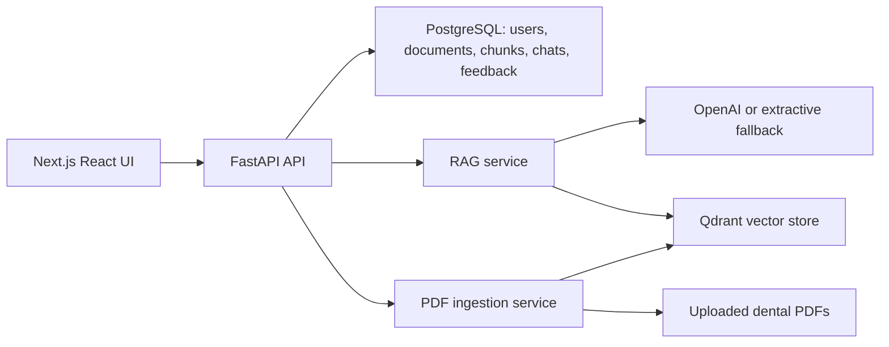

# Dental AI Chatbot

Professional MVP for a Dental AI Retrieval-Augmented Generation chatbot. The app uses FastAPI, PostgreSQL, Qdrant, PDF ingestion, JWT authentication, role-based admin tools, chat history, source citations, and a professional React/Next.js frontend with light and dark themes.

Dental AI is educational clinical decision support. It does not replace diagnosis, treatment planning, emergency care, or judgment from a licensed dentist.

## Features

- Register and login with JWT authentication.
- Roles: `admin`, `dentist`, `student`, and `patient`.
- Admin PDF upload, document list, delete, and re-ingest.
- PDF parsing with page numbers, chunk indexes, document metadata, and Qdrant point IDs.
- Qdrant vector retrieval with configurable top-k, metadata filtering, hybrid keyword/vector retrieval, reranking, and context compression.
- RAG answers grounded in retrieved dental context.
- Citations include document name, page number, chunk index, and score.
- Chat sessions, messages, document records, chunks, and feedback persisted in SQL.
- PostgreSQL and Qdrant via Docker Compose.
- React/Next.js frontend with separate pages for sign in, registration, chat, history, and admin document management.
- ChatGPT-style chat workspace with persistent light/dark theme.
- Pytest coverage for auth, chat history, feedback, admin upload, and ingestion metadata.
- No hard-coded secrets. Use `.env`.

## Architecture



## Quick Start With Docker

1. Copy the environment template.

```bash
cp .env.example .env
```

2. Edit `.env`.

Required for production-like use:

```bash
JWT_SECRET_KEY=replace-with-a-long-random-secret
OPENAI_API_KEY=your-openai-api-key
```

`JWT_SECRET_KEY` is not provided by OpenAI, Qdrant, or PostgreSQL. It is your own private random signing secret used by the backend to create and verify login tokens. Generate one locally:

```bash
python -c "import secrets; print(secrets.token_urlsafe(48))"
```

Keep this value only in `.env`. Never commit it to GitHub.

For local demos, the app still runs without `OPENAI_API_KEY`; it returns an extractive answer from the top retrieved chunk.

3. Start the stack.

```bash
docker compose up --build
```

4. Open the app.

```text
http://localhost:3000
```

5. Sign in as the configured admin.

Admin users are not created through public registration. Set `ADMIN_EMAIL` and `ADMIN_PASSWORD` in `.env`; the backend seeds that admin account into the database on startup.

The FastAPI backend is still available at:

```text
http://localhost:8000
```

## Local Development Setup

Run the backend:

```bash
python -m venv .venv
source .venv/bin/activate
pip install -r requirements.txt
cp .env.example .env
uvicorn app.main:app --reload
```

For local non-Docker development, set:

```bash
DATABASE_URL=sqlite:///./dental_ai.db
QDRANT_URL=http://localhost:6333
```

Run the frontend in another terminal:

```bash
cd frontend
npm install
npm run dev
```

Then open:

```text
http://localhost:3000
```

## Offline Ingestion

Place PDFs in `knowledge_base/`, make sure Qdrant is running, then run:

```bash
python ingest.py
```

The script stores document and chunk metadata in SQL and vectors in Qdrant. Each vector payload includes:

- `text`
- `document_id`
- `document_name`
- `book_title`
- `author_or_source`
- `year`
- `edition`
- `document_type`
- `trust_level`
- `review_status`
- `specialty`
- `language`
- `file_hash`
- `source`
- `page_number`
- `chunk_index`

## RAG Quality Evaluation

Phase 2 includes a lightweight evaluation harness for retrieval and answer quality. Add or edit JSONL cases in:

```text
docs/evaluation_dataset.jsonl
```

Each case can define:

- `question`
- `expected_terms`
- `expected_sources`
- `filters`

Run:

```bash
python scripts/evaluate_rag.py --dataset docs/evaluation_dataset.jsonl
```

For machine-readable output:

```bash
python scripts/evaluate_rag.py --json
```

The evaluator reports pass rate, expected-term recall, citation rate, and source match rate. Use this after uploading approved dental PDFs to compare retrieval changes.

## API Overview

Auth:

- `POST /api/auth/register`
- `POST /api/auth/login`

Chat:

- `POST /api/chat`
- `GET /api/chat/sessions`
- `POST /api/feedback`

Admin:

- `GET /api/admin/documents`
- `POST /api/admin/documents`
- `POST /api/admin/documents/{document_id}/reingest`
- `DELETE /api/admin/documents/{document_id}`

Health:

- `GET /api/health`
- `GET /api/disclaimer`

## Data Model

- `users`: account, password hash, role, active state.
- `documents`: uploaded PDFs and ingestion status.
- `document_chunks`: chunk text, page number, chunk index, Qdrant point ID.
- `chat_sessions`: user-owned conversations.
- `messages`: user and assistant turns, assistant citations as JSON.
- `feedback`: rating and optional comments for assistant messages.

## Tests

```bash
pytest
```

Tests mock external RAG and ingestion calls where needed, so they do not require OpenAI or Qdrant.

## Security Notes

- Never commit `.env`.
- `JWT_SECRET_KEY` must be long and random outside local demos.
- Passwords are stored with bcrypt hashing.
- Admin-only routes enforce role checks.
- Disable `ALLOW_ADMIN_REGISTRATION` after bootstrap.
- Do not expose admin registration in the public UI. Use `ADMIN_EMAIL` and `ADMIN_PASSWORD` in `.env` to seed the admin account.
- This MVP is not HIPAA-ready. Add compliance controls before handling real patient data.

## Project Structure

```text
app/
  core/          configuration, database, security
  routers/       auth, chat, admin, health APIs
  services/      RAG, ingestion, upload storage
  main.py        FastAPI application
frontend/        React/Next.js frontend
static/          legacy FastAPI-served fallback page
tests/           pytest suite
knowledge_base/  optional offline PDFs
uploaded_docs/   runtime admin uploads
docs/            developer notes and roadmap
```

## Remaining Roadmap

- Alembic migrations instead of `create_all`.
- Background ingestion jobs with progress events.
- Rate limiting and audit logs.
- Better admin dashboard with ingestion failure diagnostics.
- Larger expert-reviewed evaluation dataset for dental factuality and citation quality.
- PHI redaction, consent flows, retention policies, and deployment hardening.
- Streaming chat responses.
- Multi-tenant clinic support.
